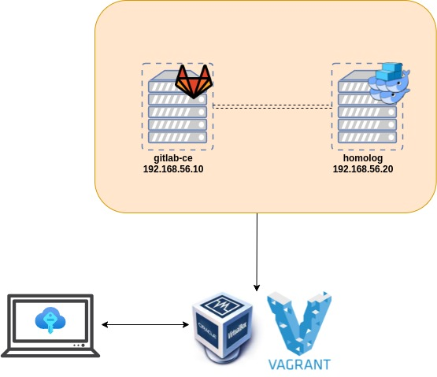

Laboratório GitLab CI
=============================

Repositório para armazenar o Laboratório do treinamento de GitLab-CI.

Laboratório
-----------

O Laboratório será criado utilizando o [Vagrant][7]. Ferramenta para criar e gerenciar ambientes virtualizados (baseado em Inúmeros providers) com foco em automação.

Nesse laboratórios, que está centralizado no arquivo [Vagrantfile][8], serão criadas 2 maquinas com as seguintes características:




Nome       | vCPUs | Memoria RAM | IP            | S.O.¹           | Script de Provisionamento²
---------- |:-----:|:-----------:|:-------------:|:---------------:| -----------------------------
gitlab     | 2     | 5076MB       | 192.168.56.10 | debian/buster64 | 
homolog    | 1     | 758MB        | 192.168.56.20 | debian/buster64 | 

> **¹**: Esses Sistemas operacionais estão sendo utilizado no formato de Boxes, é a forma como o vagrant chama as imagens do sistema operacional utilizado.

> **²**: Para o Script de Provisionamento estamos utilizando Shell Script

Criação do Laboratório 
----------------------

Para criar o laboratório é necessário fazer o `git clone` desse repositório e, dentro da pasta baixada realizar a execução do `vagrant up`, conforme abaixo:

```bash
git clone https://github.com/4linux/course-gitlab-ci
cd course-gitlab-ci/
vagrant up
```

_O Laboratório **pode demorar**, dependendo da conexão de internet e poder computacional, para ficar totalmente preparado._

> **Atenção** Para máquinas físicas com apenas 8GB de RAM recomendamos ligar apenas duas máquinas por vez.

> Em caso de erro na criação das máquinas sempre valide se sua conexão está boa, os logs de erros na tela e, se necessário, o arquivo **/var/log/vagrant_provision.log** dentro da máquina que apresentou a falha.

Por fim, para melhor utilização, abaixo há alguns comandos básicos do vagrant para gerencia das máquinas virtuais.

Comandos                | Descrição
:----------------------:| ---------------------------------------
`vagrant init`          | Gera o VagrantFile
`vagrant box add <box>` | Baixar imagem do sistema
`vagrant box status`    | Verificar o status dos boxes criados
`vagrant up`            | Cria/Liga as VMs baseado no VagrantFile
`vagrant provision`     | Provisiona mudanças logicas nas VMs
`vagrant status`        | Verifica se VM estão ativas ou não.
`vagrant ssh <vm>`      | Acessa a VM
`vagrant ssh <vm> -c <comando>` | Executa comando via ssh
`vagrant reload <vm>`   | Reinicia a VM
`vagrant halt`          | Desliga as VMs

> Para maiores informações acesse a [Documentação do Vagrant][13]

[1]: https://4linux.com.br
[2]: https://git-scm.com/downloads
[3]: https://www.virtualbox.org/wiki/Downloads
[5]: https://www.vagrantup.com/downloads
[6]: https://cygwin.com/install.html
[7]: https://www.vagrantup.com/
[8]: ./Vagrantfile
[13]: https://www.vagrantup.com/docs
[14]: https://app.vagrantup.com/4linux
